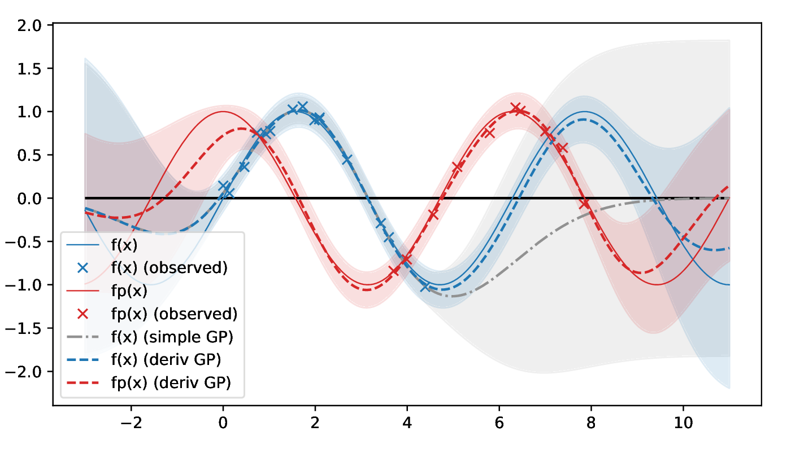

# GP-Derivative-Observations

Extends GPy with a derivative observations kernel. Take a look at [Derivative_Observations_with_GPy.ipynb](Derivative_Observations_with_GPy.ipynb), or [example_1d.py](example_1d.py) and [example_2d.py](example_2d.py).
